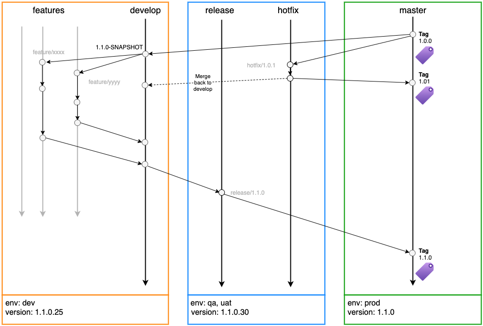
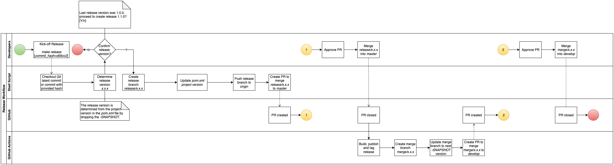
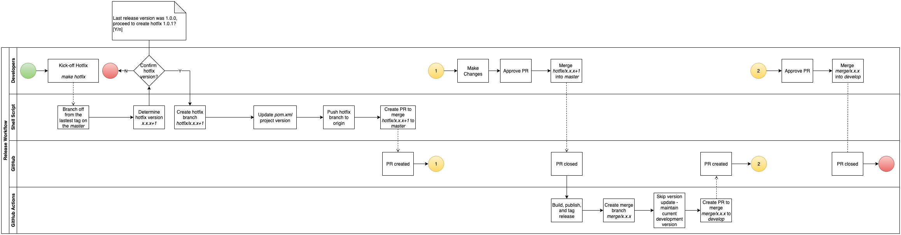
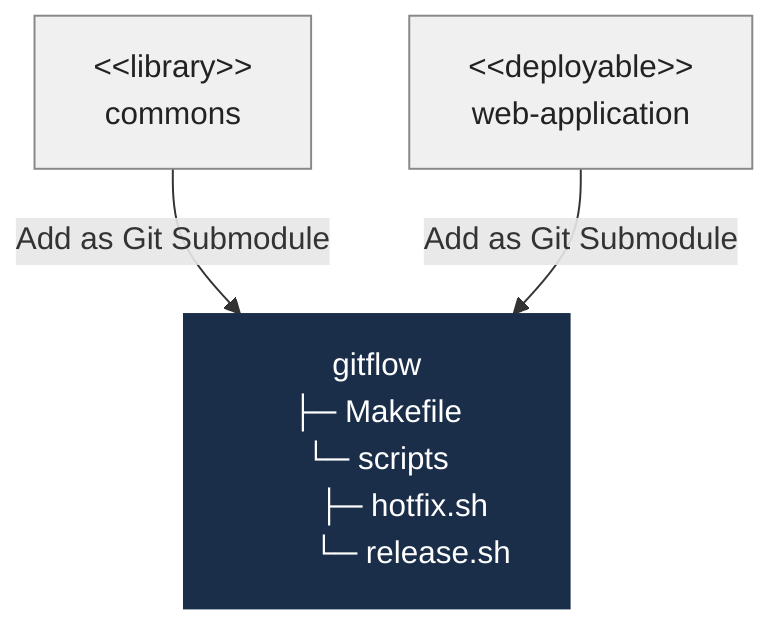

# GitFlow Branching and Release Strategy

## Introduction
The GitFlow branching strategy is a powerful and successful model for managing software releases and development. This workflow defines a strict but flexible branching model designed around the project release.  

The strategy uses two main branches: `master` and `develop`. The `master` branch always reflects the production-ready state, while the `develop` branch integrates the latest features for the upcoming release.  

Supporting branches like `feature/*`, `release/*`, and `hotfix/*` are used for specific tasks to ensure a smooth and organized development process. This strategy helps teams manage new features, prepare for releases, and quickly address production issues.

## GitFlow Workflow
  
GitFlow Workflow

### Dev Environment - Feature
- 1. Create feature branch `feature/xxxx` from `develop`.
- 2. Open Pull Request (PR) from `feature/xxxx` into `develop` -> _CI runs tests._
- 3. Close and merge PR -> _CI pushes artifacts to registry and, depening on your model deploys to the Dev environment._

Repeat the above steps multiple times.

### QA Environment - Release Candidate
- 4. Create branch `release/1.1.0` from `develop`.
- 5. Open PR from `release/1.1.0` into master -> _CI runs tests and, depending on your model deploys to the QA environment._

### Prod Environment
- 6. Close and merge PR -> _CI pushes artifact to registry and, depending on your model deploys to the Production environment._

GitFlow has 5 types of branches:

__Main Branches__  
- `master` - Always mirrors the production state.  
- `develop` - Always mirrors a state with the latest delivered development changes for the next release.  

__Supporting Branches__
- `feature/*`: Branch off from `develop`, used to create new features.
- `release/*`: Branch off from `develop` when a set of new features is ready to be released to `master`.
- `hotfix/*`: Branch off from `master`, when a quick fix needs to be deployed to `master`.

## Release Workflow
  
Release Workflow

## Hotfix Workflow
  
Hotfix Workflow

## Architecture Overview

A complete GitFlow automation stack for a service is assembled from two complementary repositories, each added to the consumer project in a different way.

GitFlow Automation Architecture

- **`gitflow`** (this repository) provides the local developer-side automation — the `Makefile` and scripts that handle branch creation, version bumping, and PR creation from a developer's machine.

Consumer projects add `gitflow` as a git submodule in the `.gitflow/` folder. The developer triggers a release or hotfix locally, and GitHub Actions takes over once the PR lands on `master`.

## How the Scripts Work

`release.sh` and `hotfix.sh` are the heart of this repository's release management strategy. `release.sh` drives the planned release cycle — branching from `develop` when a set of features is ready to ship. `hotfix.sh` handles unplanned production fixes — branching from the latest release tag on `master` to ensure no unreleased changes are inadvertently included. Together they enforce the GitFlow branching rules programmatically, reducing the risk of human error during the most critical moments of the delivery pipeline.

Both scripts are interactive — they prompt for confirmation before making any changes and exit cleanly if you decline. They require `gh` and `mvn` to be installed, and they read/write the project version exclusively through Maven (`pom.xml` must exist in the project root).

### release.sh

Run from the **`develop`** branch via `make release`.

1. Verifies you are on `develop` with a clean working tree.
2. Pulls the latest `develop` (or checks out a specific commit if `COMMIT_HASH` is supplied).
3. Reads the release version from Maven — strips the `-SNAPSHOT` suffix from the `pom.xml` version (e.g. `1.10.0-SNAPSHOT` → `1.10.0`).
4. Shows the last release tag and prompts for confirmation.
5. Creates branch `release/x.y.z` from the current commit.
6. Updates `pom.xml` to the release version via `mvn versions:set`, commits, and pushes the branch.
7. Opens a pull request targeting `master` via `gh pr create`.

### hotfix.sh

Run from the **`master`** branch via `make hotfix`.

1. Verifies you are on `master` with a clean working tree.
2. Pulls the latest `master` and tags.
3. Finds the latest git tag on `master` (must match `X.Y.Z` semver) and auto-increments the patch version (e.g. `1.0.0` → `1.0.1`).
4. Prompts for confirmation.
5. Creates branch `hotfix/x.y.z` from the **latest tag** (not HEAD of `master`), ensuring the hotfix is based on exactly what was last released.
6. Updates `pom.xml` to the hotfix version via `mvn versions:set`, commits, and pushes the branch.
7. Opens a pull request targeting `master` via `gh pr create`.

> NOTE: After either PR merges into `master`, a GitHub Actions workflow creates a back-merge PR into `develop` automatically.

## References
1. [Building an automatic CI/CD using Gitflow with GitHub Actions, Buildpack, Artifact Registry and Workload Identity Federation (12/17)](https://medium.com/@jojoooo/building-an-automatic-ci-cd-using-gitflow-with-github-actions-buildpack-artifact-registry-and-43312196cbd8)
1. [Branching Strategy Explained: Choosing the Right Workflow for Your Team](https://medium.com/towards-aws/branching-strategy-explained-choosing-the-right-workflow-for-your-team-2d9df91b3a70)
2. [A successful Git branching model](https://nvie.com/posts/a-successful-git-branching-model/)