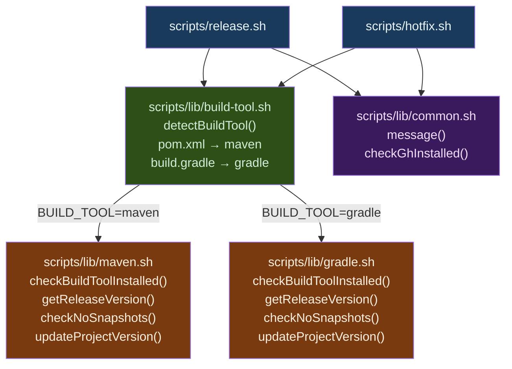
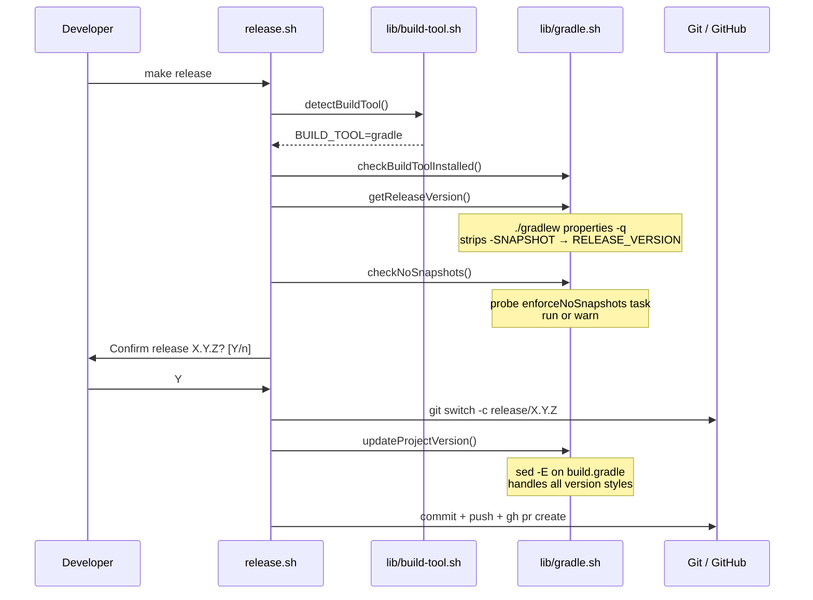
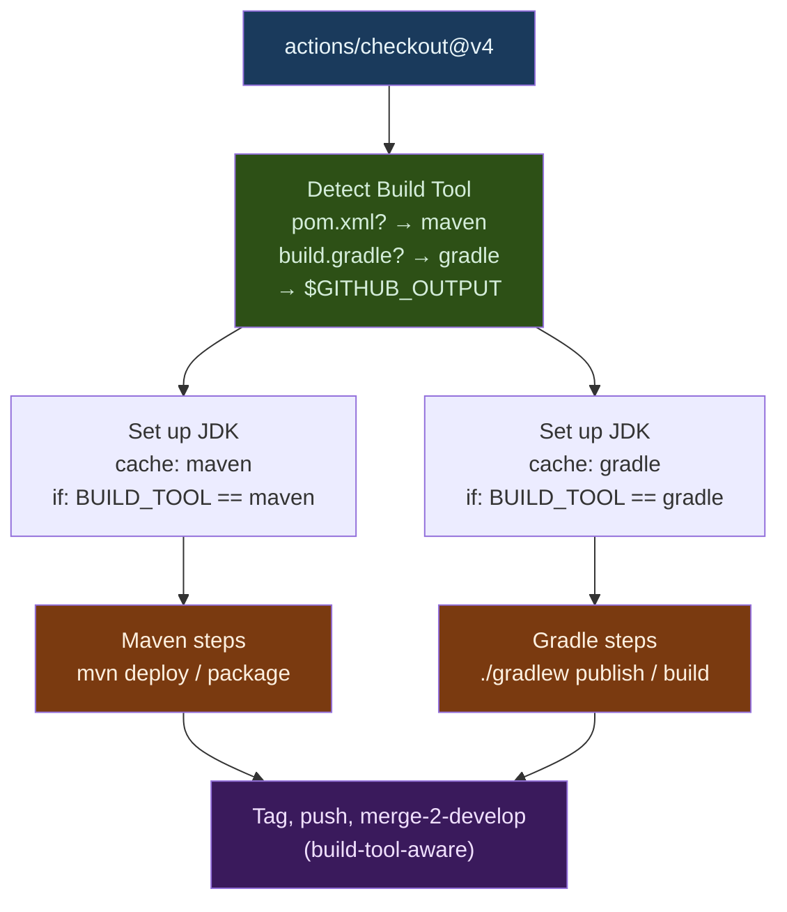

# Introduce Gradle Projects — Implementation Plan

> **For Claude:** REQUIRED SUB-SKILL: Use superpowers:executing-plans to implement this plan task-by-task.

**Goal:** Extend `release.sh` and `hotfix.sh` (and the associated GitHub Actions workflows) to handle single-project Gradle builds alongside Maven, with a clean build-tool abstraction layer.

**Architecture:** Extract all Maven-specific logic into `scripts/lib/maven.sh` and add a matching Gradle implementation in `scripts/lib/gradle.sh`. Both expose an identical function interface. `release.sh` and `hotfix.sh` auto-detect the build tool by inspecting the filesystem (`pom.xml` → Maven, `build.gradle`/`build.gradle.kts` → Gradle). The GitHub Actions workflows do the same auto-detection at runtime — no `BUILD_TOOL` input is required from consumers.

**Tech Stack:** Bash, Gradle wrapper (`./gradlew`), GitHub Actions, AWS CodeArtifact.

**Scope:** Single-project builds only. Multi-module projects are explicitly out of scope.

---

## Points to Consider — Recommendations

### 1. Gradle Submodule Handling

The `.gitflow/` directory is added to consumer projects as a git submodule. Gradle's `settings.gradle` requires **explicit** `include()` calls — it does **not** auto-discover subdirectories as subprojects. This means `.gitflow/` will **not** accidentally be included in the Gradle build by default.

**Action required by consumer teams:** Ensure `settings.gradle` does **not** reference `.gitflow` explicitly. Document this in `How-To Guide.md`.

### 2. Skipping Submodule Update on CI

In the Maven consumer project (`raise-core/pom.xml`), the `exec-maven-plugin` runs three tasks during the `validate` phase on every local build:
1. `git submodule update --init --remote` — keeps `.gitflow/` up to date
2. `chmod +x .gitflow/scripts/hotfix.sh`
3. `chmod +x .gitflow/scripts/release.sh`

The **`build` profile** disables all three by re-binding each execution to `<phase>none</phase>`. CI passes `-Pbuild` and the submodule steps are silently skipped.

**Gradle must replicate this exact pattern.** The Gradle equivalent uses the `-Pbuild` project property (same flag, different mechanism):

```groovy
// In build.gradle — runs on every local build, skipped on CI (-Pbuild)
if (!project.hasProperty('build')) {
    tasks.register('updateGitflowSubmodule') {
        doLast {
            exec { commandLine 'git', 'submodule', 'update', '--init', '--remote' }
            exec { commandLine 'chmod', '+x', '.gitflow/scripts/hotfix.sh' }
            exec { commandLine 'chmod', '+x', '.gitflow/scripts/release.sh' }
        }
    }
    // Hook into the first compilation step so it runs before any build work
    tasks.matching { it.name == 'compileJava' }.configureEach {
        dependsOn 'updateGitflowSubmodule'
    }
}
```

- **Local developer:** `./gradlew build` → submodule updated, scripts made executable
- **CI build server:** `./gradlew build -Pbuild` → submodule tasks skipped entirely
- **GitHub Actions** `build.yml`/`release.yml` already pass `-Pbuild`; no further changes needed there for submodule handling.

### 3. No-SNAPSHOT Enforcement for Gradle

Maven uses the `enforce-no-snapshots` profile (checked by probing `mvn help:all-profiles`). The Gradle equivalent follows the same probe-then-warn pattern:

1. Check if a task called `enforceNoSnapshots` is registered: `./gradlew tasks --all 2>/dev/null | grep -q "enforceNoSnapshots"`
2. If found → run it: `./gradlew enforceNoSnapshots`
3. If not found → print a warning (identical behaviour to the Maven warning today)

Consumer Gradle projects should add this task to `build.gradle`:
```groovy
tasks.register('enforceNoSnapshots') {
    doLast {
        configurations.runtimeClasspath.resolvedConfiguration.resolvedArtifacts.each { a ->
            if (a.moduleVersion.id.version.contains('SNAPSHOT')) {
                throw new GradleException("SNAPSHOT dependency found: ${a.moduleVersion.id}")
            }
        }
    }
}
```

### 4. GitHub Actions — Auto-Detection (No Manual Input)

Both `build.yml` and `release.yml` will auto-detect the build tool at runtime by checking for `pom.xml` (Maven) or `build.gradle`/`build.gradle.kts` (Gradle). No `BUILD_TOOL` input is needed from the consumer — the workflow figures it out itself.

Detection step (reused in both workflows):
```bash
if [[ -f "pom.xml" ]]; then
  echo "BUILD_TOOL=maven" >> $GITHUB_OUTPUT
elif [[ -f "build.gradle" || -f "build.gradle.kts" ]]; then
  echo "BUILD_TOOL=gradle" >> $GITHUB_OUTPUT
else
  echo "Error: no pom.xml or build.gradle found" && exit 1
fi
```

### 5. Reading the Gradle Version

The Gradle version is declared in `build.gradle` (or `build.gradle.kts`). Rather than parsing the file directly (fragile), delegate to Gradle itself:

```bash
./gradlew properties -q | grep "^version:" | awk '{print $2}'
```

This handles **all** valid ways the version can be declared in `build.gradle`:

| Declaration style | Example |
|---|---|
| Assignment, single quotes | `version = '1.0.0-SNAPSHOT'` |
| Assignment, double quotes | `version = "1.0.0-SNAPSHOT"` |
| Assignment, no spaces | `version='1.0.0-SNAPSHOT'` |
| Method call, single quotes | `version '1.0.0-SNAPSHOT'` |
| Method call, double quotes | `version "1.0.0-SNAPSHOT"` |
| Kotlin DSL | `version = "1.0.0-SNAPSHOT"` |

### 6. Writing the Gradle Version

`sed` is used to write the updated version back to `build.gradle`. The pattern must cover all declaration styles from the table above. Using `sed -E` (extended regex, supported on both macOS and Linux via `-i.bak`):

```bash
sed -i.bak -E \
  "s/^([[:space:]]*version[[:space:]]*(=[[:space:]]*)?)['\"][^'\"]+['\"]/\1'$RELEASE_VERSION'/" \
  build.gradle
rm -f build.gradle.bak
```

Pattern breakdown:
- `^([[:space:]]*version[[:space:]]*(=[[:space:]]*)?)` — matches `version` at start of line with optional leading whitespace, optional `=` (captured as group 1 to preserve the original style)
- `['\"][^'\"]+['\"]` — matches the existing quoted version value (single or double)
- Replacement `\1'$RELEASE_VERSION'` — preserves the prefix, writes new version in single quotes

The `-i.bak` approach is used because macOS `sed -i ''` and Linux `sed -i` differ; creating and deleting a backup is cross-platform.

---

## Architecture Diagram



## Release Flow (Gradle)



## GitHub Actions Auto-Detection Flow



---

## Task List

### Task 1: Create `scripts/lib/common.sh`
- [ ] Create `scripts/lib/` directory
- [ ] Extract `message()` function (identical in both scripts) into `scripts/lib/common.sh`
- [ ] Manual verification: `source scripts/lib/common.sh && message "test"` prints the formatted banner

### Task 2: Create `scripts/lib/maven.sh`
- [ ] Move `getReleaseVersion()` from `release.sh` → `scripts/lib/maven.sh` (unchanged)
- [ ] Move `updateProjectVersion()` from `release.sh` and `hotfix.sh` → `scripts/lib/maven.sh` (both are identical — consolidate here)
- [ ] Extract `checkNoSnapshots()` from the inline SNAPSHOT-check logic in both scripts
- [ ] Add `checkBuildToolInstalled()` — wraps the current `mvn` not-found check
- [ ] Manual verification: `source scripts/lib/maven.sh` in a Maven project root, call each function

### Task 3: Create `scripts/lib/gradle.sh`
- [ ] Implement `checkBuildToolInstalled()`: check for `./gradlew`; fall back to `gradle` on PATH; exit with clear error if neither found
- [ ] Implement `getReleaseVersion()`:
  ```bash
  getReleaseVersion() {
    PROJECT_VERSION=$(./gradlew properties -q | grep "^version:" | awk '{print $2}')
    RELEASE_VERSION=$(echo "$PROJECT_VERSION" | sed 's/-SNAPSHOT//')
  }
  ```
- [ ] Implement `checkNoSnapshots()`:
  ```bash
  checkNoSnapshots() {
    if ./gradlew tasks --all 2>/dev/null | grep -q "enforceNoSnapshots"; then
      ./gradlew enforceNoSnapshots
    else
      message "WARNING: 'enforceNoSnapshots' Gradle task not found — skipping SNAPSHOT dependency check"
    fi
  }
  ```
- [ ] Implement `updateProjectVersion()` using the `sed -E` pattern from section 6 above (cross-platform: `-i.bak` + `rm -f`)
- [ ] Manual verification: in a Gradle project root, source the file and call each function; test `updateProjectVersion()` against each version declaration style from the table in section 5

### Task 4: Create `scripts/lib/build-tool.sh`
- [ ] Implement `detectBuildTool()`:
  ```bash
  detectBuildTool() {
    if [[ -f "pom.xml" ]]; then
      BUILD_TOOL="maven"
    elif [[ -f "build.gradle" || -f "build.gradle.kts" ]]; then
      BUILD_TOOL="gradle"
    else
      echo "Error: no pom.xml or build.gradle/build.gradle.kts found in project root" && exit 1
    fi
  }
  ```
- [ ] Manual verification: call from a Maven root (expect `maven`), from a Gradle root (expect `gradle`), from an empty dir (expect exit 1)

### Task 5: Refactor `scripts/release.sh`
- [ ] Add at the top (after `set -e`):
  ```bash
  SCRIPT_DIR="$(cd "$(dirname "${BASH_SOURCE[0]}")" && pwd)"
  source "$SCRIPT_DIR/lib/common.sh"
  source "$SCRIPT_DIR/lib/build-tool.sh"
  ```
- [ ] Remove the `message()` function definition (now in `common.sh`)
- [ ] Remove the `updateProjectVersion()` function definition (now in the build tool lib)
- [ ] Remove the `getReleaseVersion()` function definition (now in the build tool lib)
- [ ] After the `gh` and branch checks, add:
  ```bash
  detectBuildTool
  source "$SCRIPT_DIR/lib/${BUILD_TOOL}.sh"
  checkBuildToolInstalled
  ```
- [ ] Replace inline SNAPSHOT check block with `checkNoSnapshots`
- [ ] All other logic (git branching, PR creation) remains unchanged
- [ ] Manual verification: `bash -n scripts/release.sh` (syntax check); end-to-end test on a Maven project

### Task 6: Refactor `scripts/hotfix.sh`
- [ ] Apply the same changes as Task 5
- [ ] Note: `getHotfixReleaseVersion()` is git-tag-based and build-tool-agnostic — keep it in `hotfix.sh`
- [ ] Manual verification: `bash -n scripts/hotfix.sh`; end-to-end test on a Maven project

### Task 7: Update `build.yml`
**File:** `/Users/donald/10x/awesomatic.co.za/github-actions-workflows/.github/workflows/build.yml`
- [ ] Add `Detect Build Tool` step **before** the JDK setup, outputs `BUILD_TOOL` via `$GITHUB_OUTPUT`
- [ ] Add `id: detect-build-tool` to that step
- [ ] Change existing `Set up JDK` step: add `if: steps.detect-build-tool.outputs.BUILD_TOOL == 'maven'`; rename to `Set up JDK (Maven)`
- [ ] Add `Set up JDK (Gradle)` step: `if: steps.detect-build-tool.outputs.BUILD_TOOL == 'gradle'`, `cache: 'gradle'`, no `cache-dependency-path`
- [ ] Add `Set Variables (Gradle)` step gated on `gradle`, reading version via `./gradlew properties -q`:
  ```bash
  PROJECT_VERSION=$(./gradlew properties -q | grep "^version:" | awk '{print $2}')
  ```
- [ ] Add `Deploy Library Artifact (Gradle)` step: `./gradlew publish` (no `-Pbuild` unless the consumer uses profiles — leave as `./gradlew publish`)
- [ ] Add `Build image (Gradle)` step using `./gradlew clean build` and Jib or equivalent (note in plan that exact task name is consumer-defined; document convention)
- [ ] Gate all existing Maven steps with `if: steps.detect-build-tool.outputs.BUILD_TOOL == 'maven'`
- [ ] Manual verification: review YAML syntax; trace both Maven and Gradle paths on paper

### Task 8: Update `release.yml` — `build` and `tag-release` jobs
**File:** `/Users/donald/10x/awesomatic.co.za/github-actions-workflows/.github/workflows/release.yml`
- [ ] Add `Detect Build Tool` step to the `build` job (same as Task 7)
- [ ] Gate all Maven `build` job steps with `if: steps.detect-build-tool.outputs.BUILD_TOOL == 'maven'`
- [ ] Add Gradle equivalents for `Set up JDK`, `Set Variables`, `Deploy`, `Build image` (same as Task 7)
- [ ] In `tag-release` job: add `Detect Build Tool` step and gate `Set up JDK` step per build tool
- [ ] In `Create Tag` step, replace `mvn help:evaluate` with conditional:
  ```bash
  if [[ -f "pom.xml" ]]; then
    RELEASE_VERSION=$(mvn help:evaluate -Dexpression=project.version -q -DforceStdout)
  else
    RELEASE_VERSION=$(./gradlew properties -q | grep "^version:" | awk '{print $2}')
  fi
  ```
- [ ] Manual verification: trace both paths; confirm `RELEASE_VERSION` output is identical in format for both tools

### Task 9: Update `release.yml` — `merge-2-develop` job
**File:** `/Users/donald/10x/awesomatic.co.za/github-actions-workflows/.github/workflows/release.yml`
- [ ] Add `Detect Build Tool` step before `Set up JDK`; gate the JDK setup per build tool (Maven cache vs Gradle cache)
- [ ] In the `Open PR to align develop with master` run script:
  - Replace `[[ ! -x "$(command -v mvn)" ]] && ... exit 1` with a conditional tool check:
    ```bash
    if [[ -f "pom.xml" ]]; then
      BUILD_TOOL="maven"
      [[ ! -x "$(command -v mvn)" ]] && echo "mvn not found" && exit 1
    elif [[ -f "build.gradle" || -f "build.gradle.kts" ]]; then
      BUILD_TOOL="gradle"
      [[ ! -f "./gradlew" ]] && echo "gradlew not found" && exit 1
    else
      echo "Error: no pom.xml or build.gradle found" && exit 1
    fi
    ```
  - Replace the `pom.xml` existence check + `mvn versions:set` with:
    ```bash
    if [[ "$BUILD_TOOL" == "maven" ]]; then
      pom_file=$(find . -maxdepth 1 -name "pom.xml" -print -quit)
      if [[ -n "$pom_file" ]]; then
        mvn versions:set -DnewVersion="$DEVELOPMENT_VERSION" --no-transfer-progress
      else
        echo "Error: pom.xml not found." && exit 1
      fi
    elif [[ "$BUILD_TOOL" == "gradle" ]]; then
      build_file=$(find . -maxdepth 1 \( -name "build.gradle" -o -name "build.gradle.kts" \) -print -quit)
      if [[ -n "$build_file" ]]; then
        sed -i.bak -E \
          "s/^([[:space:]]*version[[:space:]]*(=[[:space:]]*)?)['\"][^'\"]+['\"]/\1'$DEVELOPMENT_VERSION'/" \
          "$build_file"
        rm -f "${build_file}.bak"
      else
        echo "Error: build.gradle not found." && exit 1
      fi
    fi
    ```
- [ ] Manual verification: trace hotfix path (V_PATCH != 0 → skip version update) and release path (V_PATCH == 0 → update version) for both Maven and Gradle

### Task 10: Update `How-To Guide.md`
- [ ] Add a "Gradle Projects" section with:
  - Supported version declaration styles (table from section 5 of this plan)
  - Full `build.gradle` setup snippet showing both the submodule update block and `enforceNoSnapshots` task:
    ```groovy
    // ── GitFlow submodule: update locally, skip on CI (-Pbuild) ──────────────
    if (!project.hasProperty('build')) {
        tasks.register('updateGitflowSubmodule') {
            doLast {
                exec { commandLine 'git', 'submodule', 'update', '--init', '--remote' }
                exec { commandLine 'chmod', '+x', '.gitflow/scripts/hotfix.sh' }
                exec { commandLine 'chmod', '+x', '.gitflow/scripts/release.sh' }
            }
        }
        tasks.matching { it.name == 'compileJava' }.configureEach {
            dependsOn 'updateGitflowSubmodule'
        }
    }

    // ── No-SNAPSHOT enforcement (run via: ./gradlew enforceNoSnapshots) ───────
    tasks.register('enforceNoSnapshots') {
        doLast {
            configurations.runtimeClasspath.resolvedConfiguration.resolvedArtifacts.each { a ->
                if (a.moduleVersion.id.version.contains('SNAPSHOT')) {
                    throw new GradleException("SNAPSHOT dependency found: ${a.moduleVersion.id}")
                }
            }
        }
    }
    ```
  - Note that `settings.gradle` must not reference `.gitflow`
  - Note that CI passes `-Pbuild` to skip submodule steps (same convention as Maven)
  - Mermaid diagram of the Gradle release flow (can reuse the one in this plan)

---

## Review

_To be filled in after implementation._
