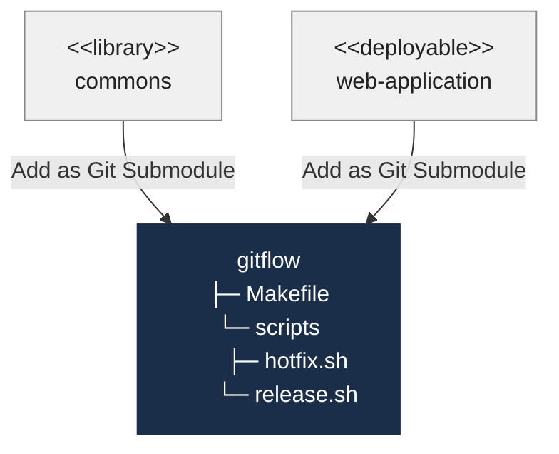
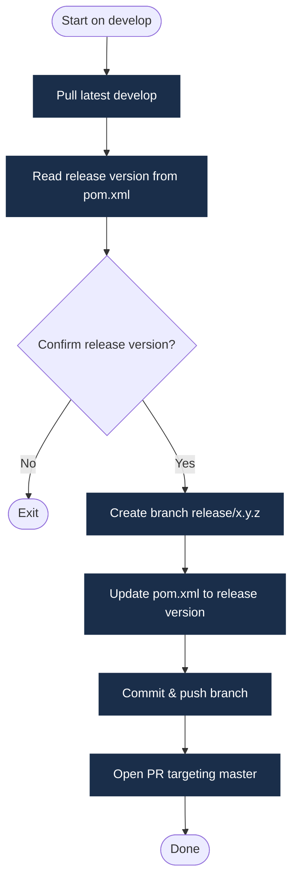
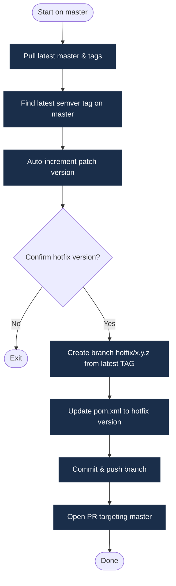

# Post-2-GitHub Implementation Plan

> **For Claude:** REQUIRED SUB-SKILL: Use superpowers:executing-plans to implement this plan task-by-task.

**Goal:** Clean up the README, scaffold a Docusaurus documentation site with Mermaid support, and publish it to GitHub Pages via a `gh-pages` branch.

**Architecture:** Docusaurus v3 lives in a `website/` directory in the repo root. A GitHub Actions workflow builds it on every push to `master` and deploys the output to the `gh-pages` branch. The existing `README.md` is cleaned of `github-actions-workflows` references; the docs site draws its content from adapted versions of `README.md` and `How-To Guide.md`, plus a new Maven Enforcer guide.

**Tech Stack:** Docusaurus 3.x, Node.js/npm, `@docusaurus/theme-mermaid`, GitHub Actions, `gh-pages` branch

---

## TODO

- [x] Task 1 — Remove `github-actions-workflows` references from `README.md`
- [x] Task 2 — Update `.gitignore` with Docusaurus and Node.js entries
- [x] Task 3 — Scaffold Docusaurus site in `website/`
- [x] Task 4 — Configure Mermaid support
- [x] Task 5 — Create documentation pages
- [x] Task 6 — Create Maven Enforcer guide page
- [x] Task 7 — Add GitHub Actions deployment workflow
- [x] Task 8 — Verify local build and commit

---

### Task 1: Remove `github-actions-workflows` references from `README.md`

**Files:**
- Modify: `README.md`

**Context:**
The Architecture Overview section in `README.md` currently contains a Mermaid `flowchart TD` that includes a `GHA["github-actions-workflows..."]` node with two dashed edges pointing at `LIB` and `DEP`. The narrative paragraph below the diagram also describes `github-actions-workflows`. Both must be removed so the repo describes only what it directly provides.

**Step 1: Remove the `GHA` node, its two edges, and update `classDef`**

In the `flowchart TD` block (lines 52–70 of README.md), replace:

```
    GHA["github-actions-workflows<br/>└─ workflows<br/>&nbsp;&nbsp;&nbsp;├─ build.yml<br/>&nbsp;&nbsp;&nbsp;&nbsp;&nbsp;&nbsp;└─ release.yml"]

    LIB["&lt;&lt;library&gt;&gt;<br/>commons"]
    DEP["&lt;&lt;deployable&gt;&gt;<br/>web-application"]

    GF["gitflow<br/>├─ Makefile<br/>└─ scripts<br/>&nbsp;&nbsp;&nbsp;&nbsp;&nbsp;&nbsp;├─ hotfix.sh<br/>&nbsp;&nbsp;&nbsp&nbsp;&nbsp;&nbsp;&nbsp;&nbsp;└─ release.sh"]

    GHA -."Reuse GitHub Actions Scripts".-> LIB
    GHA -."Reuse GitHub Actions Scripts".-> DEP
    LIB --"Add as Git Submodule"--> GF
    DEP --"Add as Git Submodule"--> GF

    classDef sharedrepo fill:#1a2e4a,stroke:#1a2e4a,color:#ffffff
    classDef consumer fill:#f0f0f0,stroke:#888888,color:#222222

    class GHA,GF sharedrepo
    class LIB,DEP consumer
```

With:

```
    LIB["&lt;&lt;library&gt;&gt;<br/>commons"]
    DEP["&lt;&lt;deployable&gt;&gt;<br/>web-application"]

    GF["gitflow<br/>├─ Makefile<br/>└─ scripts<br/>&nbsp;&nbsp;&nbsp;&nbsp;&nbsp;&nbsp;├─ hotfix.sh<br/>&nbsp;&nbsp;&nbsp;&nbsp;&nbsp;&nbsp;└─ release.sh"]

    LIB --"Add as Git Submodule"--> GF
    DEP --"Add as Git Submodule"--> GF

    classDef sharedrepo fill:#1a2e4a,stroke:#1a2e4a,color:#ffffff
    classDef consumer fill:#f0f0f0,stroke:#888888,color:#222222

    class GF sharedrepo
    class LIB,DEP consumer
```

**Step 2: Remove the `github-actions-workflows` bullet in the narrative**

Delete the paragraph that starts with `- **\`github-actions-workflows\`**` (the sentence describing reusable GitHub Actions workflow files).

Update the following `Consumer projects wire both in:` sentence to remove the reference to `github-actions-workflows`:

Replace:
```
Consumer projects wire both in: they reuse the GitHub Actions scripts from `github-actions-workflows`, and they add `gitflow` as a git submodule in the `.gitflow/` folder. Together, the two repos cover the full lifecycle: the developer triggers a release or hotfix locally, and GitHub Actions takes over once the PR lands on `master`.
```

With:
```
Consumer projects add `gitflow` as a git submodule in the `.gitflow/` folder. The developer triggers a release or hotfix locally, and GitHub Actions takes over once the PR lands on `master`.
```

**Step 3: Verify the README renders correctly**

Open `README.md` in a Markdown preview and confirm:
- The Mermaid diagram renders with only `LIB`, `DEP`, and `GF` nodes.
- No `github-actions-workflows` text appears anywhere in the file.

**Step 4: Commit**

```bash
git add README.md
git commit -m "docs: remove github-actions-workflows references from README"
```

---

### Task 2: Update `.gitignore` with Docusaurus and Node.js entries

**Files:**
- Modify: `.gitignore`

**Context:**
The current `.gitignore` only excludes `.DS_Store`. Before scaffolding Docusaurus, add all generated Node.js and Docusaurus artifacts so they are never accidentally committed. This must happen before `npm install` creates `node_modules`.

**Step 1: Replace `.gitignore` with the following content**

```
# macOS
.DS_Store

# Node.js
node_modules/

# Docusaurus generated output
website/build/
website/.docusaurus/
website/.cache-loader/
```

**Step 2: Commit**

```bash
git add .gitignore
git commit -m "chore: add Docusaurus and Node.js entries to .gitignore"
```

---

### Task 3: Scaffold Docusaurus site in `website/`

**Files:**
- Create: `website/` directory (via `npx create-docusaurus`)

**Context:**
Docusaurus v3 is scaffolded with the `classic` preset which bundles docs, blog, and the default theme. We use `website/` as the directory so the repo root stays clean.

**Step 1: Scaffold**

```bash
cd /Users/donald/github/gitflow
npx create-docusaurus@latest website classic --typescript
```

When prompted:
- Package manager: `npm`

Expected: `website/` directory created with `docusaurus.config.ts`, `sidebars.ts`, `package.json`, `docs/`, `src/`, `static/`.

**Step 2: Remove boilerplate tutorial docs**

```bash
rm -rf website/docs/tutorial-basics website/docs/tutorial-extras
rm -f website/blog/2021-08-26-welcome website/blog/2019-05-28-first-blog-post.md website/blog/2019-05-29-long-blog-post.md website/blog/2021-08-01-mdx-blog-post.mdx website/blog/authors.yml website/blog/tags.yml
```

**Step 3: Verify the scaffold builds**

```bash
cd website && npm run build
```

Expected: `Build Success` with output in `website/build/`.

---

### Task 4: Configure Docusaurus with Mermaid support

**Files:**
- Modify: `website/docusaurus.config.ts`
- Modify: `website/package.json` (add `@docusaurus/theme-mermaid`)

**Context:**
Docusaurus v3 ships Mermaid support as a first-class theme. Enable it by:
1. Adding `@docusaurus/theme-mermaid` as a dependency.
2. Setting `markdown: { mermaid: true }` in the config.
3. Adding `themes: ['@docusaurus/theme-mermaid']`.

**Step 1: Install the Mermaid theme**

```bash
cd /Users/donald/github/gitflow/website
npm install @docusaurus/theme-mermaid
```

**Step 2: Update `docusaurus.config.ts`**

Update the config object to include:

```ts
const config: Config = {
  title: 'gitflow',
  tagline: 'Automated GitFlow branching and release management',
  favicon: 'img/favicon.ico',
  url: 'https://awesomaticza.github.io',
  baseUrl: '/gitflow/',
  organizationName: 'awesomaticza',
  projectName: 'gitflow',
  onBrokenLinks: 'throw',
  onBrokenMarkdownLinks: 'warn',

  markdown: {
    mermaid: true,
  },

  themes: ['@docusaurus/theme-mermaid'],

  presets: [
    [
      'classic',
      {
        docs: {
          sidebarPath: './sidebars.ts',
          routeBasePath: '/',   // serve docs at site root
        },
        blog: false,            // disable blog
        theme: {
          customCss: './src/css/custom.css',
        },
      },
    ],
  ],

  themeConfig: {
    navbar: {
      title: 'gitflow',
      items: [
        {
          type: 'docSidebar',
          sidebarId: 'docsSidebar',
          position: 'left',
          label: 'Docs',
        },
        {
          href: 'https://github.com/awesomaticza/gitflow',
          label: 'GitHub',
          position: 'right',
        },
      ],
    },
    mermaid: {
      theme: { light: 'default', dark: 'dark' },
    },
  },
};
```

**Step 3: Update `sidebars.ts`**

Replace the generated sidebars with:

```ts
import type {SidebarsConfig} from '@docusaurus/plugin-content-docs';

const sidebars: SidebarsConfig = {
  docsSidebar: [
    'intro',
    'getting-started',
    {
      type: 'category',
      label: 'Workflows',
      items: ['workflows/release', 'workflows/hotfix'],
    },
    {
      type: 'category',
      label: 'Guides',
      items: ['guides/maven-enforcer'],
    },
  ],
};

export default sidebars;
```

**Step 4: Verify the build still succeeds**

```bash
cd /Users/donald/github/gitflow/website && npm run build
```

Expected: `Build Success`.

---

### Task 5: Create documentation pages

**Files:**
- Create: `website/docs/intro.md`
- Create: `website/docs/getting-started.md`
- Create: `website/docs/workflows/release.md`
- Create: `website/docs/workflows/hotfix.md`

**Context:**
Content is adapted from `README.md` and `How-To Guide.md`. The intro page explains what the repo is and why it exists. Getting-started walks through adding the submodule. The workflow pages contain the step-by-step instructions with terminal output.

---

**`website/docs/intro.md`**

```markdown
---
id: intro
slug: /
title: Introduction
sidebar_position: 1
---

# gitflow

`gitflow` is a **developer-side automation toolkit** for the GitFlow branching and release strategy. It provides two interactive shell scripts — `release.sh` and `hotfix.sh` — that handle branch creation, version bumping, and pull request creation from a developer's machine.

Add it as a **git submodule** to any Maven project and you can run a full release or hotfix with a single `make` command.

## What is GitFlow?

GitFlow is a branching model built around two long-lived branches:

| Branch | Purpose |
|--------|---------|
| `master` | Always mirrors the production state |
| `develop` | Integrates the latest features for the next release |

Supporting branches are created for specific tasks:

| Branch type | Pattern | Branches from |
|-------------|---------|--------------|
| Feature | `feature/*` | `develop` |
| Release | `release/x.y.z` | `develop` |
| Hotfix | `hotfix/x.y.z` | latest tag on `master` |

## Architecture



Consumer projects add `gitflow` as a git submodule in the `.gitflow/` folder. The developer triggers a release or hotfix locally, and GitHub Actions takes over once the PR lands on `master`.
```

---

**`website/docs/getting-started.md`**

```markdown
---
id: getting-started
title: Getting Started
sidebar_position: 2
---

# Getting Started

This guide walks you through adding `gitflow` to a Maven project from scratch.

## Prerequisites

| Tool | Purpose | Install |
|------|---------|---------|
| `gh` | GitHub CLI — creates PRs automatically | [Install GitHub CLI](https://cli.github.com/) |
| `make` | Delegates commands to the submodule | `brew install make` / `apt install make` |
| `mvn` | Maven — reads and writes the project version | [Install Maven](https://maven.apache.org/install.html) |

### Authenticate GitHub CLI

```bash
gh auth login
```

Follow the prompts: select `GitHub.com`, `SSH` protocol, and `Login with a web browser`.

## Step 1 — Add the Git Submodule

From the root of your project:

```bash
git submodule add git@github.com:awesomaticza/gitflow.git .gitflow
```

This creates a `.gitflow/` folder containing the scripts and Makefile.

## Step 2 — Create the Root `Makefile`

Create (or update) the `Makefile` in your project root to include the submodule's targets:

```makefile
GITFLOW_DIR := .gitflow
include $(GITFLOW_DIR)/Makefile
```

## Step 3 — Configure Maven to Initialise the Submodule

Add the following to your `pom.xml` so the submodule is checked out and kept up to date during `mvn validate`:

```xml
<build>
  <plugins>
    <plugin>
      <groupId>org.codehaus.mojo</groupId>
      <artifactId>exec-maven-plugin</artifactId>
      <version>3.5.1</version>
      <executions>
        <execution>
          <id>update-submodules</id>
          <phase>validate</phase>
          <goals><goal>exec</goal></goals>
          <configuration>
            <executable>git</executable>
            <arguments>
              <argument>submodule</argument>
              <argument>update</argument>
              <argument>--init</argument>
              <argument>--remote</argument>
            </arguments>
          </configuration>
        </execution>
        <execution>
          <id>make-hotfix-executable</id>
          <phase>validate</phase>
          <goals><goal>exec</goal></goals>
          <configuration>
            <executable>chmod</executable>
            <arguments>
              <argument>+x</argument>
              <argument>./.gitflow/scripts/hotfix.sh</argument>
            </arguments>
          </configuration>
        </execution>
        <execution>
          <id>make-release-executable</id>
          <phase>validate</phase>
          <goals><goal>exec</goal></goals>
          <configuration>
            <executable>chmod</executable>
            <arguments>
              <argument>+x</argument>
              <argument>./.gitflow/scripts/release.sh</argument>
            </arguments>
          </configuration>
        </execution>
      </executions>
    </plugin>
  </plugins>
</build>
```

### Skip the Submodule Update on CI

On a build server the submodule is already checked out by the CI system. Add this profile to suppress the `git submodule update` during CI builds:

```xml
<profiles>
  <profile>
    <id>build</id>
    <build>
      <plugins>
        <plugin>
          <groupId>org.codehaus.mojo</groupId>
          <artifactId>exec-maven-plugin</artifactId>
          <executions>
            <execution><id>update-submodules</id><phase>none</phase></execution>
            <execution><id>make-hotfix-executable</id><phase>none</phase></execution>
            <execution><id>make-release-executable</id><phase>none</phase></execution>
          </executions>
        </plugin>
      </plugins>
    </build>
  </profile>
</profiles>
```

Activate it in CI:
```bash
mvn clean package -Pbuild
```

## Step 4 — Commit

```bash
git commit -a -m "add gitflow as a submodule"
```

## Step 5 — Verify

```bash
make help
```

Expected output lists the `release` and `hotfix` targets.
```

---

**`website/docs/workflows/release.md`**

```markdown
---
id: release
title: Release Workflow
sidebar_position: 1
---

# Release Workflow

Use `make release` to cut a planned release from the `develop` branch.

## What the Script Does



1. Verifies you are on `develop` with a clean working tree.
2. Pulls the latest `develop` (or checks out a specific commit if `COMMIT_HASH` is supplied).
3. Reads the release version from Maven — strips the `-SNAPSHOT` suffix (e.g. `1.10.0-SNAPSHOT` → `1.10.0`).
4. Shows the last release tag and prompts for confirmation.
5. Creates `release/x.y.z` from the current commit.
6. Updates `pom.xml` via `mvn versions:set`, commits, and pushes.
7. Opens a pull request targeting `master` via `gh pr create`.

## Running a Release

```bash
# Standard release from the tip of develop
make release

# Release from a specific commit on develop
make release COMMIT_HASH=abc1234
```

## After the PR Merges

Once the release PR merges into `master`, a GitHub Actions workflow creates a back-merge PR into `develop` automatically. Review and approve that PR to keep `develop` in sync.
```

---

**`website/docs/workflows/hotfix.md`**

```markdown
---
id: hotfix
title: Hotfix Workflow
sidebar_position: 2
---

# Hotfix Workflow

Use `make hotfix` to apply an urgent fix directly to production (the `master` branch).

## What the Script Does



1. Verifies you are on `master` with a clean working tree.
2. Pulls the latest `master` and tags.
3. Finds the latest git tag on `master` (must match `X.Y.Z` semver) and auto-increments the patch version (e.g. `1.0.0` → `1.0.1`).
4. Prompts for confirmation.
5. Creates `hotfix/x.y.z` from the **latest tag** — not HEAD of `master` — to ensure no unreleased changes are inadvertently included.
6. Updates `pom.xml` via `mvn versions:set`, commits, and pushes.
7. Opens a pull request targeting `master` via `gh pr create`.

:::info Why branch from the tag, not HEAD of master?
HEAD of `master` might already contain the next version bump from a previous release merge. Branching from the latest tag guarantees the hotfix starts from exactly what was last shipped to production.
:::

## Running a Hotfix

```bash
make hotfix
```

## After the PR Merges

Once the hotfix PR merges into `master`, a GitHub Actions workflow creates a back-merge PR into `develop` automatically. Review and approve that PR.
```

**Step: Verify docs pages are created**

Confirm four files exist:
```
website/docs/intro.md
website/docs/getting-started.md
website/docs/workflows/release.md
website/docs/workflows/hotfix.md
```

**Step: Run local dev server to inspect pages**

```bash
cd /Users/donald/github/gitflow/website && npm start
```

Open `http://localhost:3000/gitflow/` and confirm all four pages render, including the Mermaid diagrams.

**Step: Build to confirm no broken links**

```bash
cd /Users/donald/github/gitflow/website && npm run build
```

Expected: `Build Success`.

---

### Task 6: Create Maven Enforcer guide page

**Files:**
- Create: `website/docs/guides/maven-enforcer.md`

**Context:**
This page documents how to configure the Maven Enforcer `requireReleaseDeps` rule so that `release.sh` and `hotfix.sh` fail fast if any non-test SNAPSHOT dependency is present. Content is sourced from `tasks/fixes/02-no-snapshots-in-release.md` in the raise-core project.

---

**`website/docs/guides/maven-enforcer.md`**

```markdown
---
id: maven-enforcer
title: Preventing SNAPSHOT Dependencies in Releases
sidebar_position: 1
---

# Preventing SNAPSHOT Dependencies in Releases

By default the `release.sh` and `hotfix.sh` scripts check whether a Maven profile called `enforce-no-snapshots` exists in the project. If it does, they run `mvn enforcer:enforce -Penforce-no-snapshots` **before** creating any branch. If any non-test dependency is a SNAPSHOT version the build fails immediately with a clear message — before a branch or PR is created.

Projects that have not configured the profile receive a warning and the script continues. This makes adoption gradual and non-breaking.

## Why This Matters

Shipping a SNAPSHOT dependency to production means you're releasing code that is, by definition, not yet stable. The same artifact coordinates could produce a different binary tomorrow. The Enforcer check eliminates this risk.

## Setting Up the Profile

Add the following profile to your project's `pom.xml`:

```xml
<profiles>
  <profile>
    <id>enforce-no-snapshots</id>
    <build>
      <plugins>
        <plugin>
          <groupId>org.apache.maven.plugins</groupId>
          <artifactId>maven-enforcer-plugin</artifactId>
          <version>3.5.0</version>
          <executions>
            <execution>
              <id>no-snapshot-deps</id>
              <phase>validate</phase>
              <goals>
                <goal>enforce</goal>
              </goals>
              <configuration>
                <rules>
                  <requireReleaseDeps>
                    <message>SNAPSHOT dependencies are not allowed in a release build. Please update all dependencies to release versions.</message>
                    <failWhenParentIsSnapshot>false</failWhenParentIsSnapshot>
                    <excludes>
                      <!-- Exclude test-scoped dependencies -->
                      <exclude>*:*:*:*:test</exclude>
                    </excludes>
                  </requireReleaseDeps>
                </rules>
                <fail>true</fail>
              </configuration>
            </execution>
          </executions>
        </plugin>
      </plugins>
    </build>
  </profile>
</profiles>
```

### Key Configuration Choices

| Setting | Value | Reason |
|---------|-------|--------|
| `failWhenParentIsSnapshot` | `false` | The project itself lives at `x.y.z-SNAPSHOT` on `develop` — only *dependency* SNAPSHOTs are disallowed |
| Test scope exclusion | `*:*:*:*:test` | Allows SNAPSHOT test libraries (Spock, Spring Boot Test starters) without blocking releases |
| Profile isolation | `enforce-no-snapshots` | Normal `mvn clean verify` is unaffected; only the release/hotfix scripts opt in |

## Verifying the Setup

**Confirm the profile is recognised:**
```bash
mvn help:all-profiles
```
The output should include `enforce-no-snapshots`.

**Confirm the rule passes with your current dependencies:**
```bash
mvn validate -Penforce-no-snapshots -Pbuild
```
Expected: `BUILD SUCCESS`.

**Confirm the rule fires on a SNAPSHOT dependency (optional smoke test):**

Temporarily change a dependency version in `pom.xml` to `x.y.z-SNAPSHOT`, run the command above, and verify you get:
```
BUILD FAILURE
SNAPSHOT dependencies are not allowed in a release build.
```
Revert the temporary change immediately.

## How the Scripts Use the Profile

Both `release.sh` and `hotfix.sh` contain this guard:

```bash
if mvn help:all-profiles -q 2>/dev/null | grep -q "enforce-no-snapshots"; then
  mvn enforcer:enforce -Penforce-no-snapshots -Pbuild --no-transfer-progress
else
  # Profile not present — warn and continue
  echo "WARNING: 'enforce-no-snapshots' profile not found — skipping SNAPSHOT check"
fi
```

The check runs **after** the latest commits are pulled but **before** any branch is created, so failures are fast and leave no git artifacts to clean up.
```

**Step: Verify the page renders**

```bash
cd /Users/donald/github/gitflow/website && npm run build
```

Expected: `Build Success` and the Guides sidebar item appears.

---

### Task 7: Add GitHub Actions deployment workflow

**Files:**
- Create: `.github/workflows/deploy-docs.yml`

**Context:**
The Docusaurus site is deployed to the `gh-pages` branch on every push to `master`. GitHub Pages in the repo settings must be configured to serve from the `gh-pages` branch (Source: `gh-pages` branch, `/ (root)` folder). The workflow uses the official `peaceiris/actions-gh-pages` action.

**Step 1: Create the workflow file**

```yaml
# .github/workflows/deploy-docs.yml
name: Deploy Docusaurus to GitHub Pages

on:
  push:
    branches: [master]

permissions:
  contents: write

jobs:
  deploy:
    runs-on: ubuntu-latest
    steps:
      - name: Checkout
        uses: actions/checkout@v4

      - name: Set up Node.js
        uses: actions/setup-node@v4
        with:
          node-version: '20'
          cache: npm
          cache-dependency-path: website/package-lock.json

      - name: Install dependencies
        run: npm ci
        working-directory: website

      - name: Build Docusaurus site
        run: npm run build
        working-directory: website

      - name: Deploy to gh-pages branch
        uses: peaceiris/actions-gh-pages@v4
        with:
          github_token: ${{ secrets.GITHUB_TOKEN }}
          publish_dir: website/build
          publish_branch: gh-pages
```

**Step 2: Add `website/` to `.gitignore` exclusions**

Check `.gitignore` — ensure `website/node_modules` and `website/build` are excluded (they typically are from the Docusaurus scaffold, but verify):

```
website/node_modules/
website/build/
website/.docusaurus/
```

**Step 3: Commit the workflow**

```bash
git add .github/workflows/deploy-docs.yml .gitignore
git commit -m "ci: add GitHub Actions workflow to deploy Docusaurus to gh-pages"
```

**Step 4: Configure GitHub Pages in repo settings**

After the first push triggers the workflow and creates the `gh-pages` branch:
1. Go to **Settings → Pages** in the GitHub repo.
2. Set **Source** to `Deploy from a branch`.
3. Set **Branch** to `gh-pages` and folder to `/ (root)`.
4. Save.

---

### Task 8: Final verification and commit

**Step 1: Run the full local build one last time**

```bash
cd /Users/donald/github/gitflow/website && npm run build
```

Expected: `Build Success` with no warnings about broken links.

**Step 2: Commit all documentation files**

```bash
cd /Users/donald/github/gitflow
git add website/
git commit -m "docs: add Docusaurus site with Mermaid support and GitHub Pages deployment"
```

**Step 3: Push to master**

```bash
git push origin master
```

**Step 4: Confirm the GitHub Actions workflow runs**

In the GitHub repo → Actions tab, verify the `Deploy Docusaurus to GitHub Pages` workflow completes successfully and the `gh-pages` branch is created/updated.

---

## Review

### Changes Made
- [x] `README.md` — removed `github-actions-workflows` node, edges, and narrative paragraph
- [x] `.gitignore` — added `node_modules/`, `website/build/`, `website/.docusaurus/`, `website/.cache-loader/`
- [x] `website/` — Docusaurus v3 site with Mermaid support and `staticDirectories` configured to serve `artifacts/images` directly
- [x] `website/docs/intro.md` — introduction, architecture overview with Mermaid diagram and `gitflow.png` image reference
- [x] `website/docs/getting-started.md` — submodule setup and Maven configuration
- [x] `website/docs/workflows/release.md` — release workflow guide with Mermaid diagram and `release-workflow.png` reference
- [x] `website/docs/workflows/hotfix.md` — hotfix workflow guide with Mermaid diagram and `hotfix-workflow.png` reference
- [x] `website/docs/guides/maven-enforcer.md` — SNAPSHOT dependency prevention guide
- [x] `.github/workflows/deploy-docs.yml` — GitHub Actions deployment to `gh-pages`

### Notes
- `staticDirectories: ['static', '../artifacts']` in `docusaurus.config.ts` makes `artifacts/images/*` available at `/images/*` — no file copying needed, works both locally and on GitHub Pages.
- Boilerplate `src/pages/index.tsx` and `src/pages/markdown-page.md` were removed since docs serve at the root (`routeBasePath: '/'`).
- npm cache had root-owned files; worked around by using `/tmp/npm-cache-fresh` as the cache directory.
