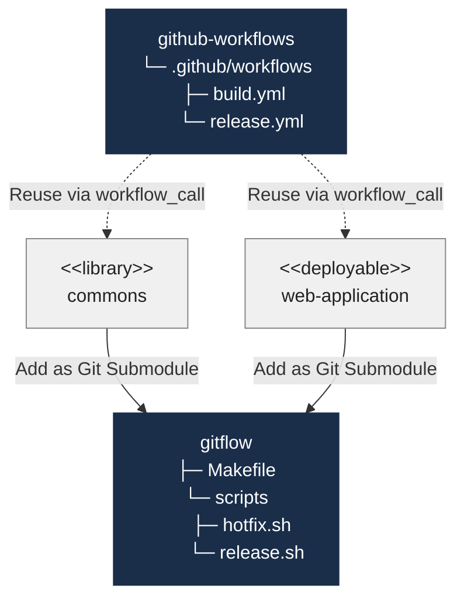

# gitflow

`gitflow` is a **developer-side automation toolkit** for the GitFlow branching and release strategy. It provides two interactive shell scripts — `release.sh` and `hotfix.sh` — that handle branch creation, version bumping, and pull request creation from a developer's machine.

Add it as a **git submodule** to any Maven project and you can run a full release or hotfix with a single `make` command.

## What is GitFlow?

GitFlow is a branching model built around two long-lived branches:

| Branch | Purpose |
|--------|---------|
| `master` | Always mirrors the production state |
| `develop` | Integrates the latest features for the next release |

Supporting branches are created for specific tasks:

| Branch type | Pattern | Branches from |
|-------------|---------|--------------|
| Feature | `feature/*` | `develop` |
| Release | `release/x.y.z` | `develop` |
| Hotfix | `hotfix/x.y.z` | latest tag on `master` |

## GitFlow Workflow

## Architecture

Consumer projects wire in both repos:

- **`gitflow`** - add this [repository](https://github.com/awesomaticza/gitflow) as a git submodule in root folder of the consumer project. To initiate the process, developers execute `make release` or `make hotfix` locally, which creates the corresponding branch and opens a PR all in one step.
- **[github-workflows](https://awesomaticza.github.io/github-workflows/)** — reusable GitHub Actions workflows referenced from the consumer project's own `.github/workflows/` folder. Once the PR lands on `master`, GitHub Actions publishes artifacts, tags the release, and opens a back-merge PR into `develop` automatically.
