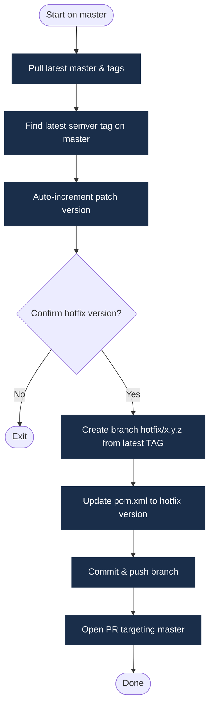

# Hotfix Workflow

Use `make hotfix` to apply an urgent fix directly to production (the `master` branch).

## What the Script Does



1. Verifies you are on `master` with a clean working tree.
2. Pulls the latest `master` and tags.
3. Finds the latest git tag on `master` (must match `X.Y.Z` semver) and auto-increments the patch version (e.g. `1.0.0` → `1.0.1`).
4. Prompts for confirmation.
5. Creates `hotfix/x.y.z` from the **latest tag** — not HEAD of `master` — to ensure no unreleased changes are inadvertently included.
6. Updates `pom.xml` via `mvn versions:set`, commits, and pushes.
7. Opens a pull request targeting `master` via `gh pr create`.

:::info Why branch from the tag, not HEAD of master?
HEAD of `master` might already contain the next version bump from a previous release merge. Branching from the latest tag guarantees the hotfix starts from exactly what was last shipped to production.
:::

## Hotfix Workflow Diagram


## Running a Hotfix

```bash
make hotfix
```

## After the PR Merges

Once the hotfix PR merges into `master`, a GitHub Actions workflow creates a back-merge PR into `develop` automatically.

:::warning Don't skip the back-merge
**Approving the back-merge PR is not optional.** If you skip it, the hotfix exists only in `master` — `develop` never receives the fix. The bug you just patched in production will reappear in the next release, and you will have no idea why.

**Always merge the back-merge PR before resuming feature development.**
:::
