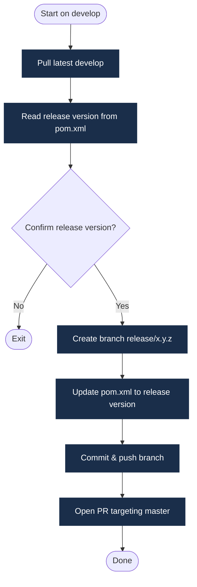

# Release Workflow

Use `make release` to cut a planned release from the `develop` branch.

## What the Script Does



1. Verifies you are on `develop` with a clean working tree.
2. Pulls the latest `develop` (or checks out a specific commit if `COMMIT_HASH` is supplied).
3. Reads the release version from Maven — strips the `-SNAPSHOT` suffix (e.g. `1.10.0-SNAPSHOT` → `1.10.0`).
4. Shows the last release tag and prompts for confirmation.
5. Creates `release/x.y.z` from the current commit.
6. Updates `pom.xml` via `mvn versions:set`, commits, and pushes.
7. Opens a pull request targeting `master` via `gh pr create`.

## Release Workflow Diagram


## Running a Release

```bash
# Standard release from the tip of develop
make release

# Release from a specific commit on develop
make release COMMIT_HASH=abc1234
```

## After the PR Merges

Once the release PR merges into `master`, the [github-workflows](https://github.com/awesomaticza/github-workflows/blob/master/.github/workflows/release.yml) release script takes over and does the following:

1. **Publishes the release artifact** — either to AWS CodeArtifact (libraries) or AWS ECR as a Docker image (deployable services).
2. **Creates a git tag and GitHub Release** for the version in `pom.xml`.
3. **Opens a back-merge PR** (`merge/x.y.z → develop`) and bumps the minor version for the next development sprint (e.g. `1.2.0` → `1.3.0-SNAPSHOT`).

:::warning Don't skip the back-merge
**Approving the back-merge PR is not optional.** If you skip it, `develop` falls behind `master` — the release version bump and any release-branch fixes are lost from the development line. The next release will be cut from stale code, and `develop` will silently diverge from what is running in production.

**Always merge the back-merge PR before starting any new feature work.**
:::
